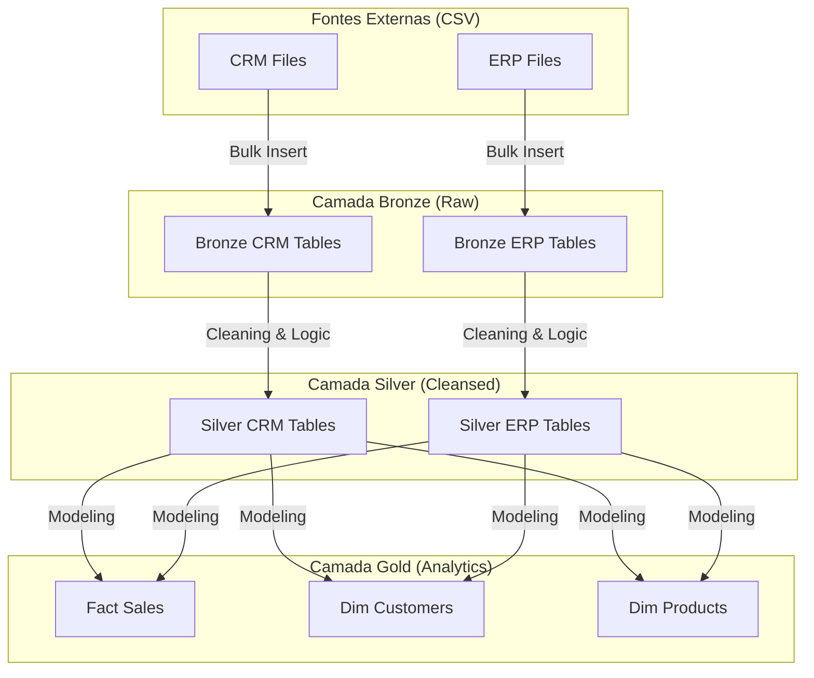
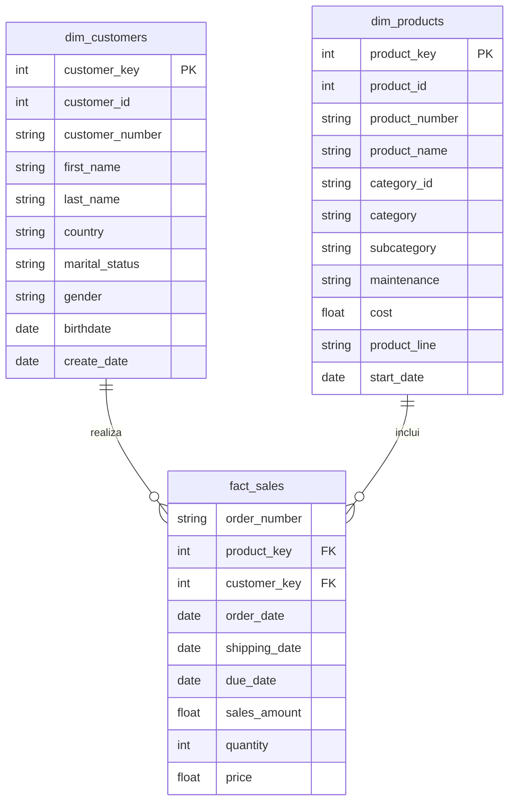

# 🏗️ Construção do Data Warehouse (Medallion Architecture)

Este módulo é o coração do projeto, onde a infraestrutura de dados é construída utilizando a **Arquitetura Medallion** no SQL Server. O objetivo é garantir que os dados brutos de sistemas heterogêneos (CRM e ERP) sejam transformados em uma fonte de verdade confiável e performática.

---

## 🏗️ Arquitetura e Fluxo de Dados

O projeto foi estruturado em uma arquitetura de **três camadas lógicas** para garantir **separação de responsabilidades**, **rastreabilidade** e **clareza no fluxo de transformação dos dados**. O pipeline parte de arquivos extraídos de dois sistemas de origem, **CRM** e **ERP**, passa pelas camadas **Bronze** e **Silver**, e termina na **Gold**, onde os dados são organizados em um modelo dimensional pronto para análise.

### Fontes de Dados
Os dados de entrada chegam em arquivos **CSV** organizados em pastas e representam informações de dois sistemas diferentes:

#### **CRM**
Responsável pelos dados mais ligados ao relacionamento comercial e transacional:
- `crm_sales_details`: detalhes das vendas/transações;
- `crm_cust_info`: informações cadastrais de clientes;
- `crm_prd_info`: informações cadastrais de produtos.

#### **ERP**
Responsável por complementar os dados operacionais e cadastrais:
- `erp_cust_az12`: dados adicionais de clientes;
- `erp_loc_a101`: informações de localização;
- `erp_px_cat_g1v2`: categorias e classificações de produtos.

Essa separação entre CRM e ERP é importante porque cada sistema contribui com partes diferentes da visão de negócio. Enquanto o CRM concentra os eventos de venda e alguns cadastros, o ERP complementa atributos mestres que enriquecem a análise final.

### 1. **Bronze Layer (Raw)**
A camada Bronze é responsável pela **ingestão inicial** dos arquivos CSV no SQL Server. Nessa etapa, cada arquivo de origem é carregado para sua tabela correspondente, preservando o conteúdo o mais próximo possível da fonte original.

O objetivo dessa camada é funcionar como uma **área de aterrissagem dos dados**, sem aplicação de regras de negócio ou transformações analíticas. Aqui, o foco está em garantir:
- preservação da estrutura original;
- rastreabilidade da origem;
- facilidade de reprocessamento;
- isolamento da etapa de ingestão.

A carga foi implementada com **`BULK INSERT`** e automatizada por **Stored Procedure**, seguindo estratégia de **Full Load** com **`TRUNCATE` + `INSERT`**.

### 2. **Silver Layer (Cleansed)**
A camada Silver recebe as tabelas brutas da Bronze e aplica o tratamento técnico necessário para tornar os dados confiáveis e consistentes.

O fluxo segue, de forma geral, a mesma estrutura da camada anterior:
- `crm_sales_details` → `crm_sales_details`
- `crm_cust_info` → `crm_cust_info`
- `crm_prd_info` → `crm_prd_info`
- `erp_cust_az12` → `erp_cust_az12`
- `erp_loc_a101` → `erp_loc_a101`
- `erp_px_cat_g1v2` → `erp_px_cat_g1v2`

Embora os nomes permaneçam, o conteúdo passa por etapas como:
- padronização de tipos de dados;
- limpeza de registros inválidos;
- remoção de duplicidades;
- ajuste de nomenclaturas;
- normalização de campos;
- criação de colunas auxiliares.

A Silver funciona como a camada de **qualidade técnica**, preparando os dados para integração entre sistemas e evitando que inconsistências da origem cheguem à camada analítica.

### 3. **Gold Layer (Business)**
Na camada Gold, os dados tratados da Silver são integrados e reorganizados com foco em negócio, seguindo uma modelagem dimensional em **Star Schema**.

As tabelas finais são:

- `fact_sales`: tabela fato com os eventos de venda;
- `dim_customers`: dimensão de clientes;
- `dim_products`: dimensão de produtos.

---

## 📊 Modelo de Dados (Gold)

#### **Fato de vendas**
A tabela **`fact_sales`** é derivada principalmente de:
- `crm_sales_details`

Ela concentra as métricas e eventos centrais do processo analítico, servindo como base para indicadores e agregações.

#### **Dimensão de clientes**
A dimensão **`dim_customers`** é construída a partir da integração de:
- `crm_cust_info`
- `erp_cust_az12`
- `erp_loc_a101`

Esse processo consolida atributos cadastrais e complementares de clientes, criando uma visão mais rica e analiticamente útil.

#### **Dimensão de produtos**
A dimensão **`dim_products`** é formada a partir da integração de:
- `crm_prd_info`
- `erp_px_cat_g1v2`

Com isso, a dimensão passa a conter não apenas o cadastro básico dos produtos, mas também classificações e categorias importantes para segmentações e análises de desempenho.

## 🛡️ Data Quality (Garantia de Qualidade)
Foram desenvolvidos scripts de auditoria específicos para validar a consistência dos dados em cada camada do pipeline (ex.: `quality_check_gold.sql`).

As verificações incluem:
- integridade referencial entre fatos e dimensões;
- identificação de registros órfãos;
- testes de unicidade de chaves substitutas;
- validação de domínios categóricos;
- checagem de consistência após as transformações da Silver e da Gold.

Essa etapa foi importante para reforçar a confiabilidade da base analítica final

## Desafios Superados
- **Padronização de Fontes:** Dados de CRM e ERP possuíam formatos distintos de gênero e país. Na camada **Silver**, criamos mapeamentos (`CASE WHEN`) para unificar as nomenclaturas.
- **Qualidade de Datas:** Datas de nascimento futuras no ERP foram tratadas como `NULL`, e datas de vendas em formato `INT` foram convertidas para `DATE`.
- **Integridade Financeira:** Identificamos casos onde `Sales` != `Qty * Price`. Implementamos uma lógica de recálculo automático para priorizar a verdade aritmética.

## 📖 Documentação Adicional
- **[Catálogo de Dados](./docs/data_catalog.md):** Dicionário de colunas e tipos.
- **[Convenções de Nomenclatura](./docs/naming_conventions.md):** Padrões adotados.