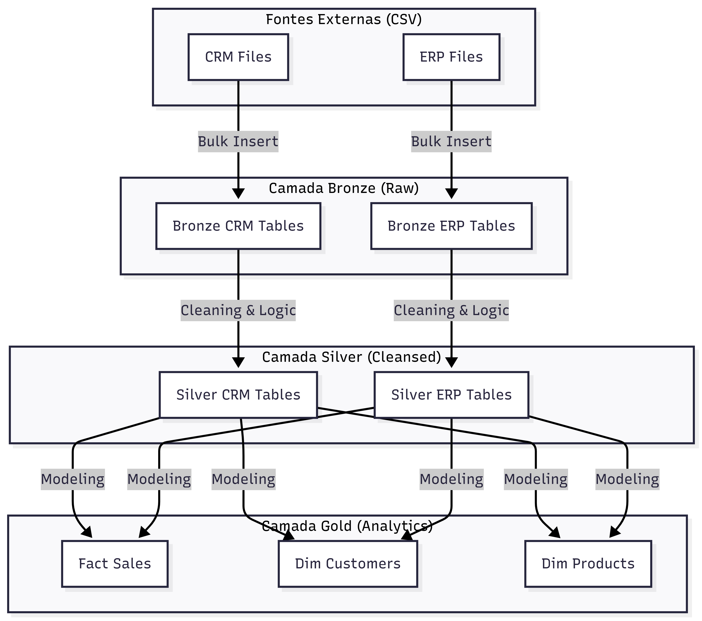

# 🛡️ SQL Data Warehouse & Analytics: Projeto End-to-End (Arquitetura Medallion)

[](https://www.microsoft.com/sql-server)
[](./01_Data_Warehouse/README_DW.md)
[](./03_Data_Exploration/README_ANALYSIS.md)
[](./tests/)

Este repositório apresenta a construção de um ecossistema de dados completo, transformando dados brutos de sistemas legados em uma base de alta performance para tomada de decisão estratégica.

---

## 💼 Contexto de Negócio
Muitas empresas sofrem com o "Silêncio de Dados", onde informações cruciais estão espalhadas em sistemas diferentes que não se conversam. Neste projeto, simulamos o cenário de uma empresa de varejo que possui:
- **CRM:** Dados de vendas e cadastro básico de clientes.
- **ERP:** Dados de localização, categorias de produtos e detalhes demográficos.

**O Desafio:** Unificar essas fontes para responder perguntas simples, como: *"Qual o perfil demográfico dos nossos clientes VIP e quais categorias eles mais compram?"*

---

## 🏗️ Estrutura do Repositório


```text
sql-data-warehouse-project/
├── 01_Data_Warehouse/              # Camada de Engenharia e ETL
│   ├── 01_Setup/                   # Inicialização (DB, Schemas)
│   ├── 02_Bronze/                  # Ingestão Raw (Bulk Insert)
│   ├── 03_Silver/                  # Limpeza e Padronização
│   ├── 04_Gold/                    # Modelagem Star Schema (Views)
│   └── README_DW.md                # [Deep Dive] Detalhes Técnicos do DW
├── 02_Analytics_Reporting/         # Camada Semântica (Entrega de Dados)
├── 03_Data_Exploration/            # Camada de Analytics e Insights
│   ├── 01_eda_overview.sql          # Dashboard de Saúde do Negócio
│   ├── 02_adhoc_trends_analysis.sql # Tendências e Segmentação Avançada
│   └── README_ANALYSIS.md           # [Deep Dive] Casos de Uso e Storytelling
├── data/                           # Origem (Arquivos CSV: CRM e ERP)
├── docs/                           # Documentação Técnica e Diagramas
├── tests/                          # Garantia de Qualidade (Data Quality)
├── run_pipeline.sql                # Orquestrador de Execução (Master Script)
└── README.md                       # Documentação Principal
```

---

## 📚 Documentação Detalhada

Para facilitar a exploração técnica, este projeto utiliza uma abordagem de **documentação modular**. Dependendo do seu interesse, você pode mergulhar em guias específicos:

*   🏗️ **[Engenharia: Data Warehouse Deep Dive](./01_Data_Warehouse/README_DW.md)**  
    Focado na infraestrutura. Detalha o processo de ETL, a lógica de limpeza na camada Silver, o dicionário de dados da camada Gold e estratégias de performance e integridade referencial.

*   📈 **[Analytics: Advanced Insights & Storytelling](./03_Data_Exploration/README_ANALYSIS.md)**  
    Focado na extração de valor. Explica as perguntas de negócio respondidas, as técnicas de SQL avançado utilizadas (Window Functions, CTEs) e como as Views facilitam o consumo de dados.

---

## ⚙️ O Pipeline de Dados 



O projeto implementa a **Arquitetura Medallion**, garantindo que o dado evolua em qualidade a cada etapa:

1.  **Bronze (Ingestão):** O dado entra "como está". Utilizamos **SQL Dinâmico** para tornar o processo de ingestão escalável e independente de caminhos de pasta fixos.
2.  **Silver (Refino):** Aplicamos o "Data Cleaning". Corrigimos datas inválidas (ex: 1900-01-01), padronizamos gêneros ('M', 'F', 'n/a') e consolidamos endereços fragmentados.
3.  **Gold (Inteligência):** Criamos um **Modelo Dimensional (Star Schema)**. Aqui, unimos CRM e ERP através de **Surrogate Keys** (chaves substitutas), garantindo que a análise de vendas seja rápida e confiável.

---

## 💡 Insights Extraídos 
Utilizando técnicas de **SQL Avançado**, o projeto entrega respostas automáticas para:
- **Segmentação de Clientes:** Identificação automática de clientes **VIP** (Alto gasto + Fidelidade).
- **Análise de Recência:** Identificação de produtos e clientes que estão perdendo o engajamento.
- **Performance de Crescimento:** Cálculo de **YoY (Year over Year)** e **Running Totals** para acompanhar a meta de vendas.
- **Curva ABC de Produtos:** Quais itens realmente trazem receita versus quais geram custo de estoque.

---

## 🛠️ Diferenciais Técnicos 
- **Segurança e Organização:** Uso estrito de Esquemas SQL (`bronze`, `silver`, `gold`) para isolamento de dados.
- **Código Reutilizável:** Procedures parametrizadas que facilitam a manutenção.
- **Data Quality:** Scripts de teste dedicados para garantir que não existam "dados órfãos" ou duplicatas na camada final.
- **Documentação Modular:** Documentações específicas para perfis diferentes (Engenharia vs Negócio).

---

## 🚀 Como Executar o Projeto

1.  **Setup:** Execute `01_Data_Warehouse/01_Setup/01_init_database.sql`.
2.  **Estrutura:** Crie as DDLs e Procedures (Pastas `02_Bronze` a `04_Gold` em ordem numérica).
3.  **Carga:** Rode o `run_pipeline.sql` para processar o ETL completo.
4.  **Análise:** Consulte as views em `02_Analytics_Reporting` ou explore os scripts da pasta `03`.

---


## 🎓 Créditos e Agradecimentos
Inspirado e construído com base na metodologia de **Data with Baraa** (YouTube), com extensões proprietárias em modelagem dimensional, documentação modular e práticas avançadas de Analytics Engineering.


